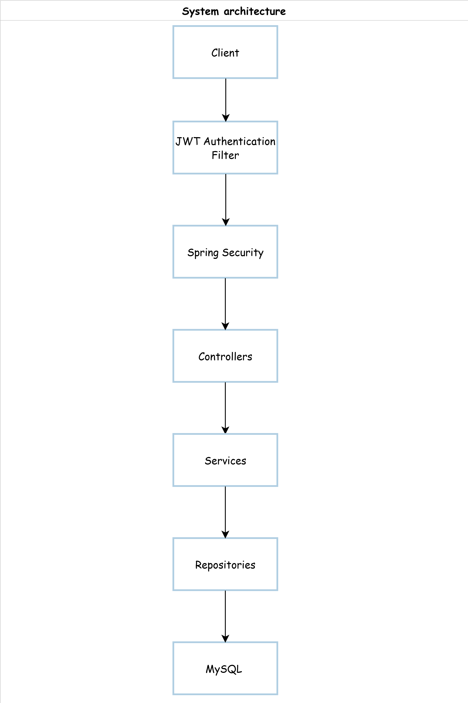
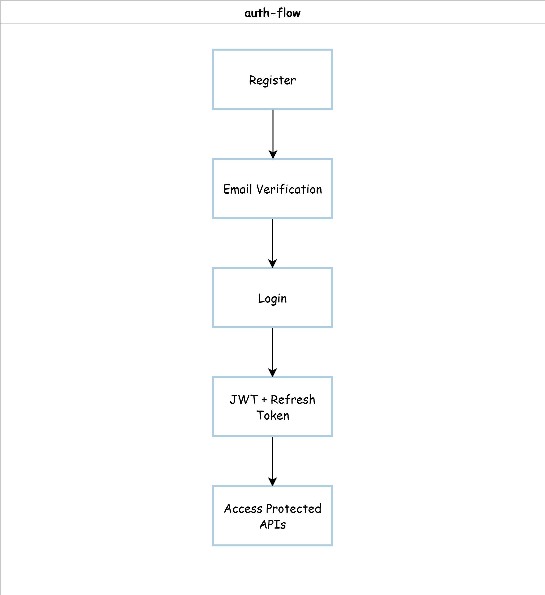
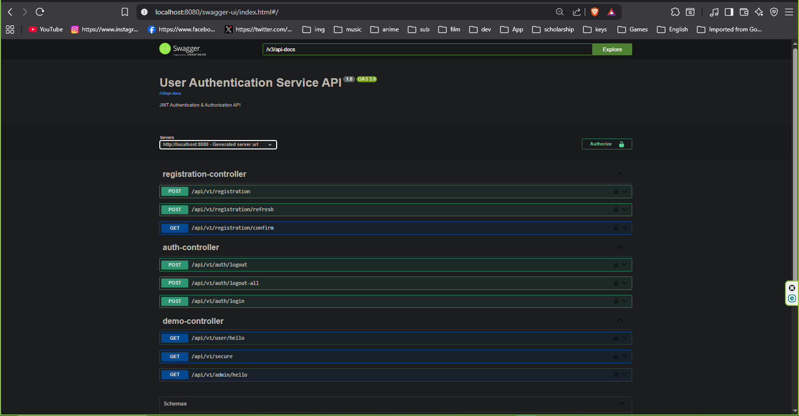
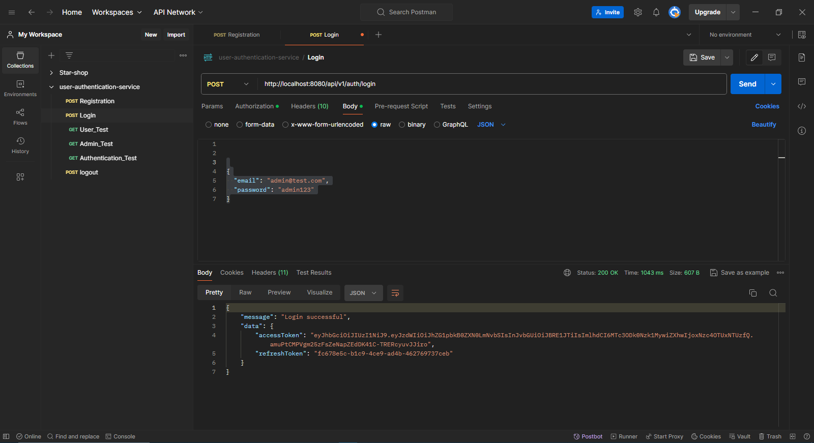
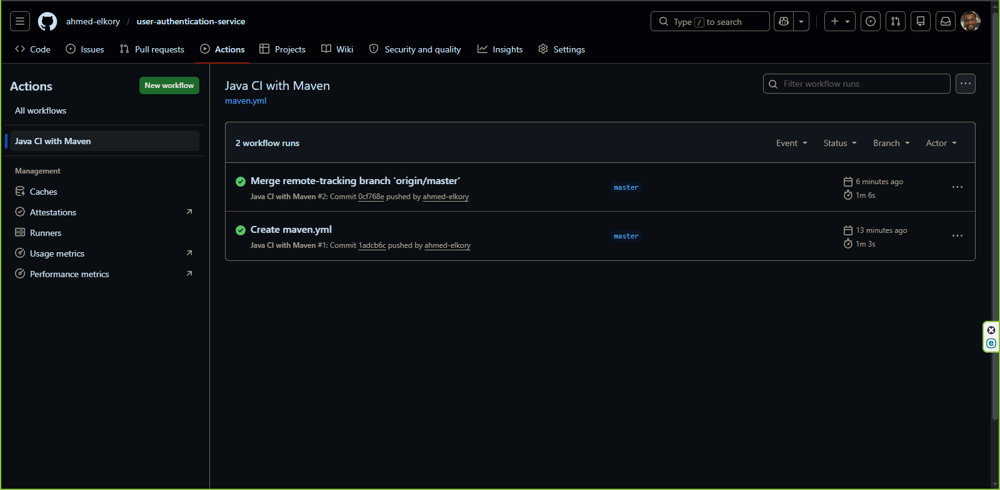

---

# 🔐 User Authentication Service


[](https://github.com/ahmed-elkory/user-authentication-service/actions/workflows/maven.yml)


A production-oriented authentication and authorization backend built with Spring Boot.

This project implements secure user authentication using JWT access tokens, refresh token rotation, email verification, role-based authorization, rate limiting, automated testing, Dockerized deployment, and GitHub Actions CI/CD following modern backend engineering practices.

---

# 🚀 Features

* 🔐 JWT Authentication & Authorization
* 🔄 Refresh Token Support
* 📧 Email Verification Workflow
* 👤 Role-Based Access Control (RBAC)
* 🚫 Account Locking Protection
* ⚡ Rate Limiting
* 🧹 Scheduled Token Cleanup
* 🌍 Environment-Based Configuration
* 🛡️ Global Exception Handling
* 📖 Swagger / OpenAPI Documentation
* 🐳 Docker & Docker Compose Support
* 🔁 GitHub Actions CI/CD Pipeline
* 🧪 Unit / Integration / E2E Testing

---

# 🧱 System Architecture

The application follows a layered backend architecture:

```text
Client
   ↓
JWT Authentication Filter
   ↓
Spring Security
   ↓
Controllers
   ↓
Services
   ↓
Repositories
   ↓
Database
```

## Architecture Diagram



---

# 🔄 Authentication Flow

```text
User Registration
        ↓
Email Verification
        ↓
Login
        ↓
JWT Access Token + Refresh Token
        ↓
Access Protected Endpoints
        ↓
Refresh Token Rotation
```

## Authentication Flow Diagram



---

# 📂 Project Structure

```bash
user-authentication-service/
│
├── .github/workflows/
├── docs/
├── src/
│   ├── main/
│   └── test/
├── Dockerfile
├── docker-compose.yml
├── pom.xml
└── README.md
```

## Main Modules

| Module                | Responsibility                    |
| --------------------- | --------------------------------- |
| `appuser`             | User management                   |
| `registration`        | Registration & email verification |
| `login`               | Authentication logic              |
| `security.jwt`        | JWT generation & validation       |
| `security.rate_limit` | Request throttling                |
| `security.scheduler`  | Token cleanup tasks               |
| `email`               | Email sending service             |
| `exceptions`          | Global exception handling         |

---

# 🔐 Security Features

This project includes several production-oriented security mechanisms:

* JWT-based authentication
* Refresh token rotation
* BCrypt password hashing
* Account lock after failed login attempts
* Rate limiting protection
* Email verification workflow
* Secure environment variable management
* Global exception handling
* Stateless authentication architecture

---

# 🛠️ Tech Stack

## Backend

* Java 21
* Spring Boot 3.3
* Spring Security
* Spring Data JPA
* Hibernate

## Database

* MySQL
* H2 Database (testing)

## Security

* JWT (jjwt)
* BCrypt

## DevOps

* Docker
* Docker Compose
* GitHub Actions

## Testing

* JUnit 5
* Mockito
* Spring Boot Test

## Documentation

* Swagger / OpenAPI

---

# 📡 API Documentation

Interactive API documentation is available through Swagger UI:

```bash
http://localhost:8080/swagger-ui/index.html
```

## Swagger UI Preview



---

# 📮 Postman Collection

The repository includes a complete Postman collection for testing all authentication flows.

## Included Requests

* User Registration
* Email Confirmation
* Login
* Refresh Token
* Logout
* Protected Endpoints
* Role-Based Access Testing

## Postman Preview



## Collection Location

```bash
docs/postman/user-authentication-service.postman_collection.json
```

---

# 📡 API Endpoints

| Method | Endpoint                       | Description              |
| ------ | ------------------------------ | ------------------------ |
| POST   | `/api/v1/registration`         | Register a new user      |
| GET    | `/api/v1/registration/confirm` | Confirm email token      |
| POST   | `/api/v1/auth/login`           | Authenticate user        |
| POST   | `/api/v1/auth/refresh`         | Refresh access token     |
| POST   | `/api/v1/auth/logout`          | Logout user              |
| GET    | `/api/v1/user/hello`           | USER protected endpoint  |
| GET    | `/api/v1/admin/hello`          | ADMIN protected endpoint |

---

# ⚙️ Running Locally

## 1. Clone Repository

```bash
git clone https://github.com/YOUR_USERNAME/user-authentication-service.git

cd user-authentication-service
```

---

## 2. Configure Environment Variables

Create a `.env` file based on:

```bash
.env.example
```

Example:

```env
DB_USERNAME=root
DB_PASSWORD=root

JWT_SECRET=your_secret_key
JWT_EXPIRATION=3600000

MAIL_USERNAME=your_email@gmail.com
MAIL_PASSWORD=your_app_password

ADMIN_EMAIL=admin@test.com
ADMIN_PASSWORD=admin123
```

---

## 3. Run With Docker

```bash
docker-compose up --build
```

Application URL:

```bash
http://localhost:8080
```

---

## 4. Run Without Docker

Make sure MySQL is running locally.

Then execute:

```bash
./mvnw spring-boot:run
```

---

# 🐳 Docker Support

## Build Docker Image

```bash
docker build -t user-authentication-service .
```

## Run Docker Containers

```bash
docker-compose up
```

---

# 🧪 Testing

The project contains multiple testing layers:

* Unit Tests
* Integration Tests
* End-to-End Tests

Run all tests:

```bash
./mvnw test
```

---

# 🔁 CI/CD Pipeline

GitHub Actions automatically:

* Builds the application
* Runs automated tests
* Validates Maven build
* Verifies Docker image build

Workflow location:

```bash
.github/workflows/maven.yml
```

## GitHub Actions Preview



---

# 📁 Environment Profiles

The project supports multiple Spring profiles:

| Profile  | Purpose                |
| -------- | ---------------------- |
| `dev`    | Local development      |
| `prod`   | Production environment |
| `docker` | Docker container setup |
| `test`   | Automated testing      |

---

# 🚀 Future Improvements

Planned improvements for scalability and production readiness:

* Redis-backed refresh token storage
* Token identifier strategy
* OAuth2 / Google Login
* Kubernetes deployment
* AWS deployment
* Prometheus & Grafana monitoring
* Centralized logging
* Multi-factor authentication (MFA)
* Testcontainers integration

---

# 👨‍💻 Author

Ahmed Abdarrahmane Elkory

Software Engineer & Backend Developer

Focused on:

* Spring Boot
* Backend Architecture
* Security Engineering
* Scalable Distributed Systems

GitHub:
https://github.com/ahmed-elkory

LinkedIn:
https://www.linkedin.com/in/ahmed-elkory

---

# ⭐ Support

If you found this project useful, feel free to star the repository and explore the codebase.
